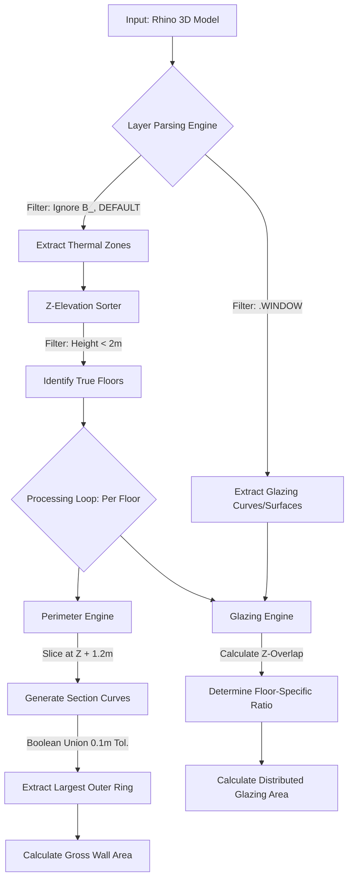

# Automated WWR (Window-to-Wall Ratio) Extractor for Rhino3D

A robust Python tool for Rhino that automates the extraction of Window-to-Wall Ratios directly from complex 3D thermal massing models. Designed to accelerate environmental building performance analysis and green building certification workflows (such as LEED and EEWH) by replacing manual geometric calculations with a fault-tolerant parsing algorithm.

## 🚀 The Problem

In environmental design and energy modeling, calculating the accurate Window-to-Wall Ratio (WWR) is a critical but notoriously time-consuming step. Standard architectural models are built for visual representation, not data extraction, leading to several geometric roadblocks:
* **The "Swiss Cheese" Effect:** Floor slabs with interior holes (elevator cores, shafts) inflate perimeter calculations if blindly measured.
* **Micro-Gaps:** Thermal zones modeled with tiny 1-10mm gaps cause standard Boolean Union algorithms to fail.
* **Multi-Story Massing:** Both thermal zones (e.g., atriums, MEP rooms) and continuous facade glazing often span multiple floors, breaking scripts that assume a strict 1-to-1 relationship between an object and a floor level.

## 💡 The Solution

This script bypasses native architectural drafting flaws by treating the 3D model as a pure mathematical data structure. 

### Key Algorithmic Features
1. **Zero-Click Layer Auto-Detection:** Automatically scans the layer tree, isolating thermal zones and `.WINDOW` layers while filtering out non-computable data (e.g., underground basements, shading devices, and 2D artifacts).
2. **"Gap-Swallowing" Boolean Union:** To calculate the true gross exterior envelope, the script dynamically slices the building 1.2m above each floor and applies a 10cm tolerance union. This virtually "inflates" and "deflates" the geometry to bridge drafting gaps and isolate the single largest exterior perimeter ring, automatically discarding interior shaft boundaries.
3. **Proportional Area Distribution:** Instead of forcing a multi-story window to "belong" to a single floor, the script compares the window's 3D bounding box against the absolute Z-elevations of each floor. It mathematically calculates the vertical overlap ratio and distributes the true square meterage proportionately across the floors it touches.
4. **Outlier-Resistant Floor Detection:** Detects true architectural stories using a 1.5m sorting tolerance while explicitly ignoring double-height anomalies or "ghost zones" (artifacts < 2m tall) to establish accurate floor-to-floor heights via sequence subtraction.

## 📊 System Architecture

## 🛠 Usage

1. Open your 3D thermal massing model in Rhino.
2. Ensure your layers are structured logically (e.g., above-ground zones on standard layers, underground zones prefixed with `B_`, and windows on a `.WINDOW` layer).
3. Run `EditPythonScript` and execute `calculate_wwr_massing_flat_v6.py`.
4. The script will run silently in the background (disabling Redraw for maximum computational speed).
5. A save dialog will appear to export the clean `.csv` dataset.

## 📄 Output Data Structure

The tool outputs a clean, simulation-ready CSV file mapped per floor:

| Floor | Elevation Z (m) | Height (m) | Gross Perimeter (m) | Gross Wall Area (sqm) | Glazing Area (sqm) | WWR % |
| :--- | :--- | :--- | :--- | :--- | :--- | :--- |
| 1 | 0.00 | 6.00 | 251.20 | 1507.20 | 602.88 | 40.00 |
| 2 | 6.00 | 4.50 | 251.20 | 1130.40 | 678.24 | 60.00 |

## ⚙️ Dependencies
* Rhinoceros 3D (Tested on Rhino 7/8)
* `rhinoscriptsyntax`
* `Rhino.Geometry`

